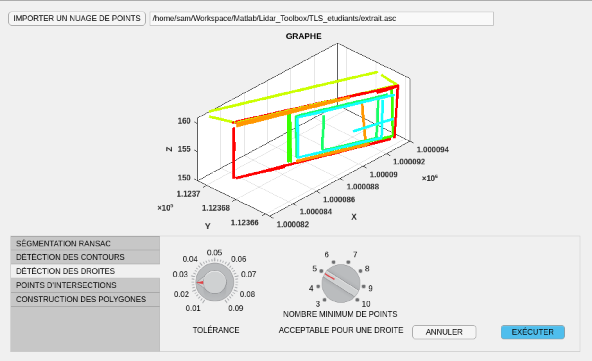

## Facade 3D Lidar Modeling
Automatic segmentation of a building facade using 3D Lidar points in Matlab

    

## Features
- RANSAC Segmentation

    

    

- Contour Detection

    

- Lines Detection

    

- Points of Intersection

    

## Prerequisites
- Matlab : **2018a** or above
- Development Environment : Matlab App Designer
## Installation

1. Install Matlab **2018a** or above
2. Open Matlab App Designer with `appdesigner` Command
3. Hit Open & Add The modelisation_lidar.mlapp file
4. Hit Run

## License

    

